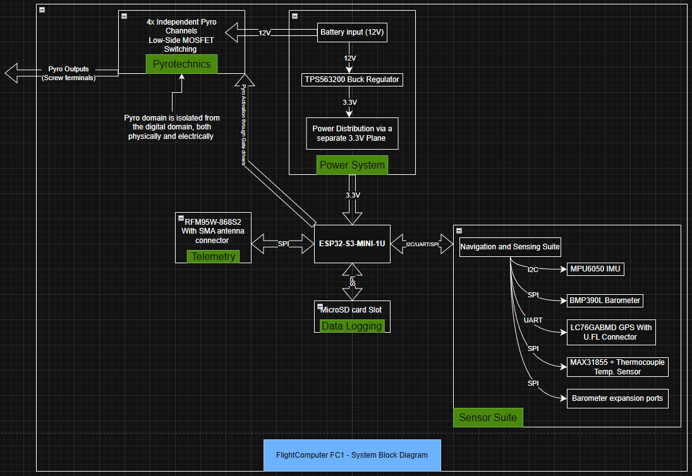

# Flight_ComputerFC1
4-Layer Avionics Flight Computer PCB with EMI-aware power management, RF telemetry, GNSS integration, Dual Barometric sensing, four redundant Pyro Channels for safety-critical flight operations

## Overview
FC1 is a custom-designed avionics flight computer intended for high-powered rocketry applications. The system is designed with a strong emphasis on reliability, EMI-aware layout, and defensible system-level tradeoffs.
The board integrates power management, RF telemetry, GNSS, redundant sensing, microSD card logging, and safety critical outputs into a single 4-Layer PCB.

---

## Key Features
- 4-Layer PCB with Continuous ground reference for signal and power integrity
- Single-stage 12 V -> 3.3 V power architecture using TI TPS563200
- RF telemetry interface for real-time flight data
- GNSS L1 integration for flight data logging and recovery
- Onboard barometric sensor with expansion interface for a secondary barometer
- SD card interface for onboard data logging
- Four independent pyro channels for safety-critical deployment events

---

## Design Focus
- Power integrity and EMI control through tight loop minimization and decoupling placement
- Explicit tradeoffs between efficiency, noise, component size, and layout complexity
- Expandability in sensing architecture without compromising baseline reliability
- Redundancy and fault tolerance in deployment paths
- Design decisions documented and defended in industry-style technical reviews

---

## System Architecture
The flight computer is organised around the following functional domains:
- Power management and protection
- Microcontroller and digital logic
- RF telemetry subsystem
- GNSS, Barometric sensing and expansion interfaces
- SD card datalogging subsystem
- Pyrotechnic deployment and safety circuitry

Each domain was designed and reviewed independently before system integration.

---

## Status
- Schematic: Complete
- PCB layout: Complete
- Hardware validation: Pending fabrication and bring-up

---

## Tools used
- TI WEBENCH Power designer (Power domain referencing)
- KiCAD (Schematic capture and PCB layout)
- MATLAB (Analysis, Simulations, and validation support

---

## Notes
This repository focuses on system-level design, architecture and documented engineering decisions.
Firmware, validation data, and test results will be added after hardware bring-up.
